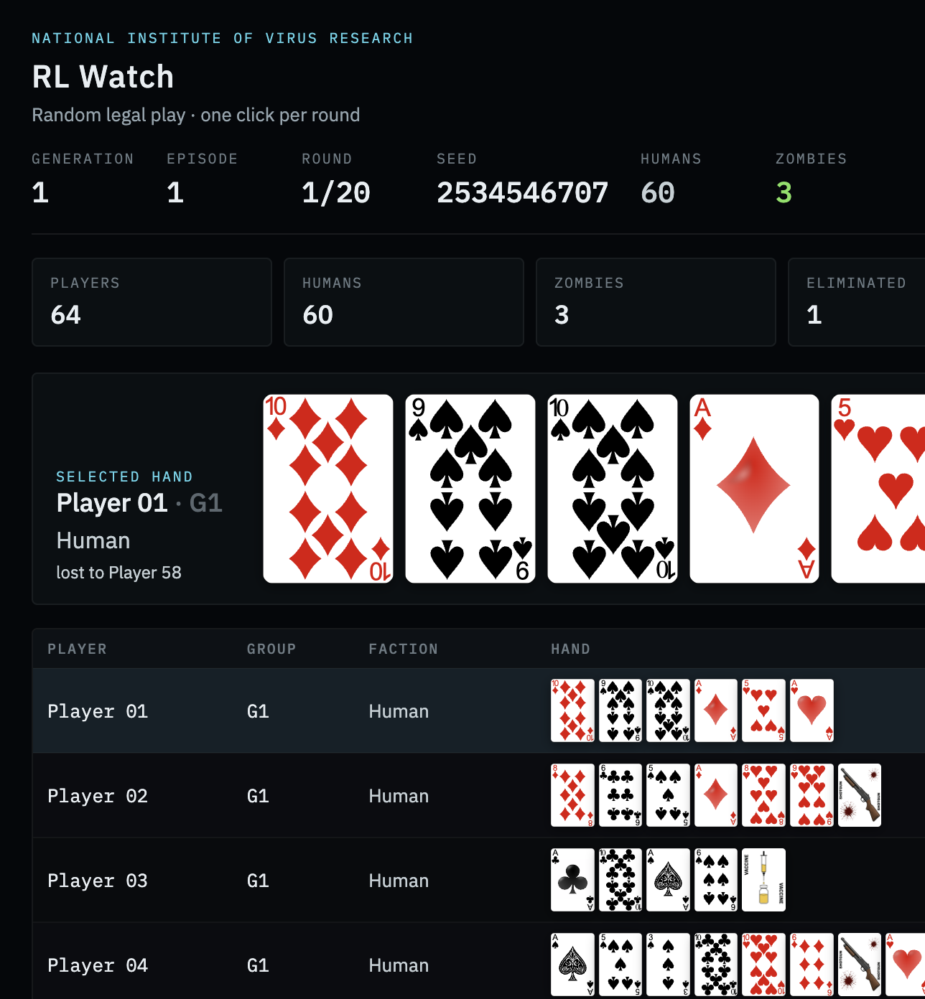
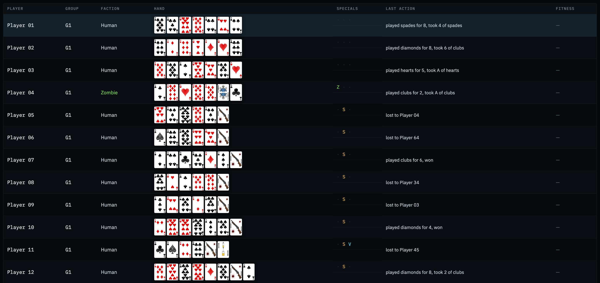
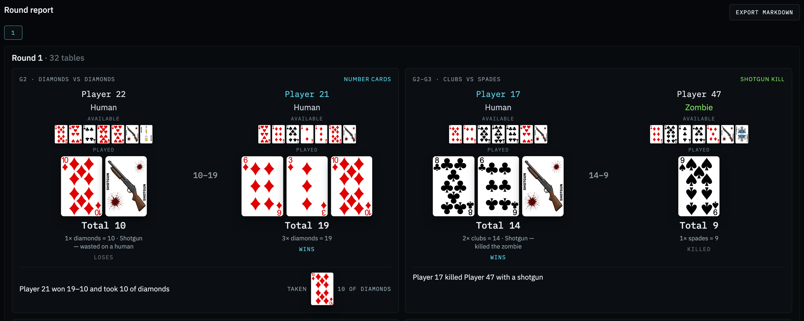

# Tughluq — Zombie Hunt

Browser simulation of *Zombie Hunt* (Alice in Borderland, Netflix). The watch page runs a 64-player tournament (4 groups × 16) for twenty rounds so we can later search for a strategy with reinforcement learning.



## Run locally

Node.js 20 or newer.

```bash
make dev
```

Open [http://127.0.0.1:5173/watch](http://127.0.0.1:5173/watch). If port 5173 is taken, Vite prints another address (often `5174`).

Other targets: `make build`, `make preview`, `make test`, `make clean`.

Headless matches (no browser):

```bash
npm run simulate -- --seed 1 --episodes 20 --policy randomLegal
npm run simulate -- --seed 1 --episodes 20 --policy aggressive --reference randomLegal
npm run train -- --seed 1 --generations 8 --population 8 --episodes 5
npm run simulate -- --seed 1 --episodes 20 --weights docs/weights-latest.json --reference randomLegal
```

## Match

- **64 players**, four groups of 16. **20 rounds.**
- Opening hand is **seven cards including specials**. Number cards are A–10 (Ace = 1). No J, Q, or K.
- Every player gets a Shotgun. One Zombie card per group. Vaccines are random (two per group in this build).
- Each player chooses a suit from their own hand and plays a non-empty subset. Compare sums. The winner takes one card the loser put down.
- Specials may go down with the pile or alone. An uncancelled Zombie infects and copies itself. Shotgun kills a zombie (wasted on a human). Vaccine cancels a Zombie card played this duel.
- **Play round** steps one random-legal round. Click a roster row to enlarge that hand.



## Round report

Pick a round from the bar — only that round is on screen. Each table shows the **available** hand before the play and the **played** pile.

**Export Markdown** downloads a compact `zh-md/1` log (`zh-s{seed}-r{n}.md`) meant for an LLM: pip tokens (`AS`, `10H`), `shot` / `zombie` / `vax`, factions `H` / `Z` / `X`, pre-play hands, outcomes, and a final roster.



## Docs

| File | Contents |
| --- | --- |
| [`docs/rules.md`](docs/rules.md) | Working rules |
| [`docs/rules-audit.md`](docs/rules-audit.md) | Source notes vs engine |
| [`docs/plan.md`](docs/plan.md) | Product roadmap |
| [`docs/baselines-2026-09-16.md`](docs/baselines-2026-09-16.md) | Stage A policy baseline table |
| [`docs/train-log.md`](docs/train-log.md) | Linear ES train log |
| [`docs/rl-explained.md`](docs/rl-explained.md) | How the linear trainer works |
| [`docs/ATTRIBUTION.md`](docs/ATTRIBUTION.md) | Card art credits |

Regular faces are Byron Knoll's public-domain vector cards (A–10 in play). Specials (Zombie, Shotgun, Vaccine) were drawn for this project. See the attribution file.
