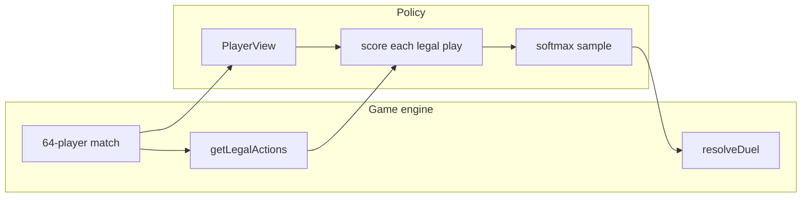
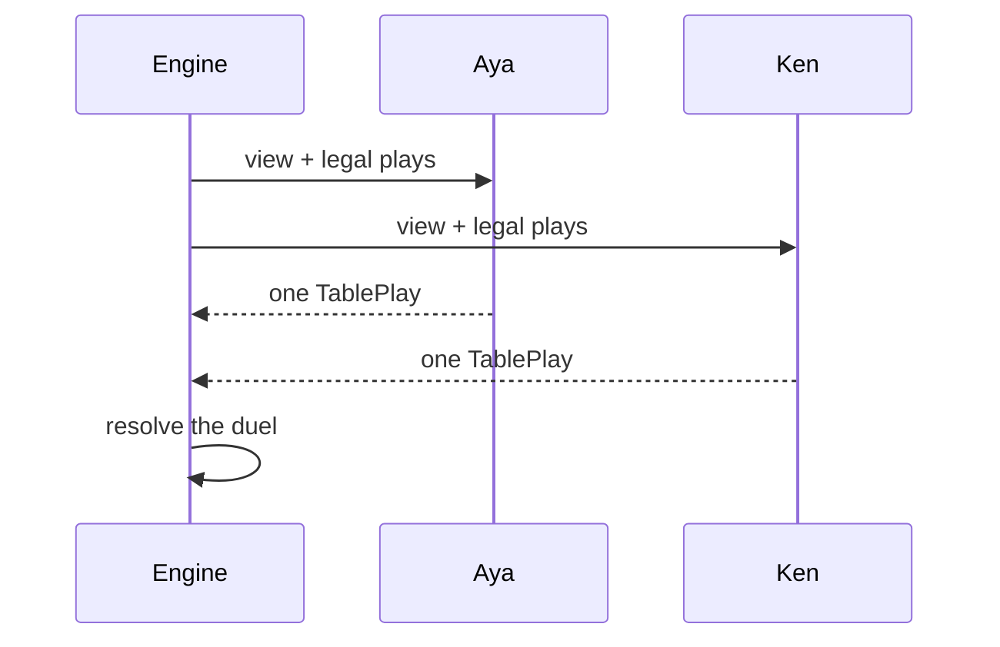
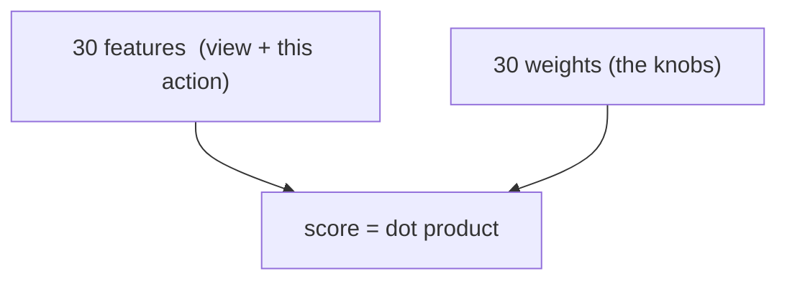
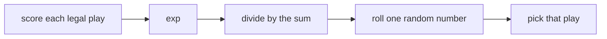
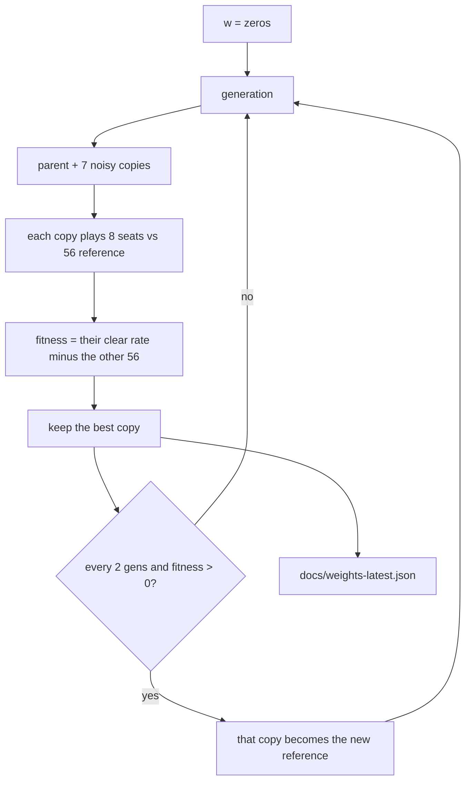
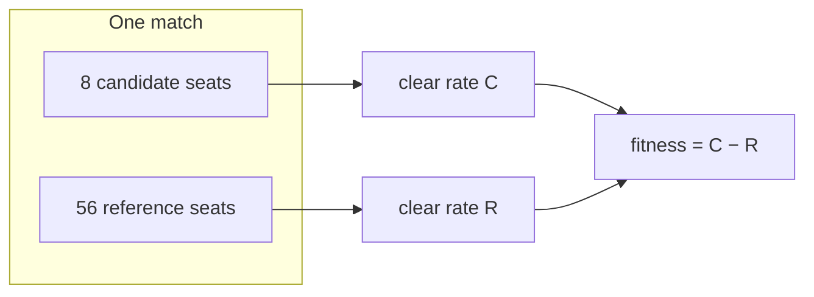

# How the linear trainer works (Zombie Hunt)

This is a walkthrough of Stage B on **this** project, not a general RL textbook.
The game is the 64-player, 20-round *Zombie Hunt* match. The code lives in `src/rl/`.
Saved weights: [`weights-latest.json`](./weights-latest.json). Run log: [`train-log.md`](./train-log.md).

## The one sentence

A **policy** is a function: *given what I am allowed to know, pick one legal play*.
Training searches for a better function than “pick at random” by turning **30 knobs**
(the weights) and keeping the knob settings that win more often.

It does **not** pick a winner among `randomLegal`, `aggressive`, and `conservative`.
Those three are handwritten yardsticks. The trainer writes a *fourth* function into
`docs/weights-latest.json`.



## One decision at the table

Round 3. Aya sits against Ken. Pairing was random — she did not choose him.
She does **not** know if Ken is infected, and she does **not** know the living
zombie share. She knows her own cards, whether *she* is infected, how many cards
Ken is holding, the round number, and how many people are still alive.

The engine lists every legal play (every non-empty suit subset, with or without a
special). Vaccine is always on that list if she holds one; playing it against a
human is a miss and the card is gone. Shotgun is a guess.

Aya’s policy must pick **exactly one** row from that list. Ken’s policy picks at
the same time. Then the engine resolves shotgun / vaccine / zombie / sums / theft.



That happens at most once per living player per round, for 20 rounds, for 64 seats.
One match is 64 short stories that share one ending: the larger living faction
clears, the rest do not.

## Features: the situation as numbers

The policy does not read English. It reads two number lists glued together
(`concatFeatures` in `src/rl/features.ts`):

1. **View (20 numbers)** — who I am right now. Same for every legal play in this
   decision.
2. **Action (10 numbers)** — what this particular play would put on the table.

| Index | View feature | Meaning |
| --- | --- | --- |
| 0–2 | Spades count, sum, high rank | My spade pile |
| 3–5 | Hearts | |
| 6–8 | Diamonds | |
| 9–11 | Clubs | |
| 12 | Has shotgun | 1 or 0 |
| 13 | Has zombie card | 1 or 0 |
| 14 | Has vaccine | 1 or 0 |
| 15 | I am infected | 1 or 0 |
| 16 | My number-card count | Hit points / ammo |
| 17 | Opponent hand size | Cards Ken holds, not what they are |
| 18 | Round / 20 | How late we are |
| 19 | Living players | Headcount only |

Missing on purpose: Ken’s faction, Ken’s cards, living zombie share.

| Index | Action feature | Meaning |
| --- | --- | --- |
| 20 | Pile sum | Printed numbers on the cards I would play |
| 21 | Pile size | How many number cards I would expose |
| 22 | High rank in the pile | What I risk to theft if I lose |
| 23 | Share of that suit committed | 1 = I dump the whole suit |
| 24 | Share of my regulars committed | |
| 25 | Regulars left after this play | Cards I would still have |
| 26 | Special = none | 1 if this play has no special |
| 27 | Special = shotgun | |
| 28 | Special = zombie | |
| 29 | Special = vaccine | |

Exactly one of 26–29 is 1.

## Weights: 30 knobs

A weight is one number next to one feature. The whole policy is 30 weights
`w[0] … w[29]`. Start of training: all zeros. After training they are the array
in `docs/weights-latest.json`.

**Score of one legal play:**

```
score = w[0]*feature[0] + w[1]*feature[1] + … + w[29]*feature[29]
```

A **positive** weight means “this feature makes the play more attractive”.
A **negative** weight means the opposite. Magnitude is “how much”.



That is the whole “brain”. There is no hidden layer. If a useful rule needs an
*interaction* — “play Zombie only when I am already infected” — a linear scorer
cannot say it. It can only add `w[15]*infected` (same for every action) and
`w[28]*isZombiePlay` (same whether I am infected or not). That limit is why
later stages talk about an MLP.

### The linear gotcha

In one decision the 20 view numbers are identical for every legal play. Adding
`w_view · view` to every score does not change which play wins the softmax.
**Only the 10 action weights choose the card.** The view weights still sit in
the file (noise from evolution), but they do not steer Aya this generation.

That is why a linear search tends to rediscover a simple rule like “attach
Zombie to a pile”, which is close to the handwritten `aggressive` baseline.

## From scores to a play: softmax

Suppose Aya has three legal plays and the scorer returns:

| Play | Score |
| --- | --- |
| Small hearts, no special | −2.3 |
| Those hearts plus Zombie | +0.0 |
| Shotgun only | −1.5 |

The policy does **not** always take the maximum. Duels are simultaneous; a
predictable player is exploitable. It converts scores to probabilities with
`exp(score)` and **samples**:

```
P(play) = exp(score) / sum of exp(all scores)
```

Higher score → more often, not always. Zero weights → every `exp(0) = 1` →
uniform random, which is `randomLegal`.



## Interpreting the trained weights

Held-out file after 8 generations (seed 1). Action knobs only — these are the
ones that actually pick plays:

| Index | Feature | Weight | Reading |
| --- | --- | --- | --- |
| 20 | Pile sum | **+0.86** | Prefer a bigger number total |
| 21 | Pile size | +0.14 | Slight lean to more cards |
| 22 | High rank | +0.67 | Willing to flash a high card |
| 23 | Suit share | −0.77 | Avoid dumping a whole suit |
| 24 | Regular share | −0.51 | Avoid emptying the hand |
| 25 | Regulars left | −0.90 | Odd hitchhiker: more leftovers lower the score |
| 26 | No special | **−1.06** | Numbers-only is unattractive |
| 27 | Shotgun | −0.53 | Do not shotgun much (it is a guess) |
| 28 | Zombie | **+1.29** | Strongest knob: put Zombie down |
| 29 | Vaccine | **+1.24** | Also likes Vaccine — risky, because a miss is spent |

Worked toy: Aya has the 2 of hearts and a Zombie card.

- Hearts, no special: pile sum 2 plus “no special” (−1.06) → low score.
- Hearts **plus** Zombie: same pile sum **and** +1.29 → much more likely.

So the learned rule is not “Zombie alone”. It is closer to **`aggressive`**:
play Zombie when you hold it, and prefer a fat number pile.

That matches the measured result: vs `randomLegal` the elite is **+0.271**
(Stage A `aggressive` was +0.257). Vs an `aggressive` table the elite is
**−0.070**. Linear search found the same neighbourhood; it did not beat the
handwritten heuristic.

## How training works

We never compute a gradient. We **nudge the knobs at random** and keep the
nudge that scored better. That is an evolution strategy.

Start: `w = 30 zeros` (plays like `randomLegal`).
Each **generation**:

1. Keep the parent `w`.
2. Make 7 copies, each weight `+= 0.2 * gaussian noise` (`population` 8).
3. Grade every copy with the **same** match seeds.
4. The copy with the highest fitness becomes the new parent.
5. Every 2 generations, if that elite still beats the current **reference**
   league, freeze it as the new reference.



Default command:

```bash
npm run train -- --seed 1 --generations 8 --population 8 --episodes 5
```

Eight generations × eight copies × five matches is a few seconds in Node.
It is a short search, not a proof of optimality.

## Fitness: why 8 seats vs 56

Reward for one player is **1** if they are alive on the larger faction after
round 20, else **0**. Tie of factions → 0 for everyone.

If all 64 seats run the same policy, they mostly share one fate: zombies win
together or humans win together. Absolute clear rate then measures the
faction split, not skill.

So a **candidate** sits in **8** seats. The other **56** run the reference
(`randomLegal` at first, later a frozen elite). Same deal, same seed.

```
fitness = clear rate of the 8 − clear rate of the 56
```

If the 8 land on the winning side more often than the 56, fitness is positive.
`aggressive` vs `randomLegal` was +0.257. That is the bar.



The log also prints numbers we **do not** maximize: zombie share when all 64
seats run the elite, and elite vs `aggressive`. Those are a dashboard. Mass
infection is a story hypothesis, not the training objective. Pairing is still
random and infection is still private, so “convert everyone” may never be the
linear attractor.

## What the log columns mean

From [`train-log.md`](./train-log.md):

| Column | Meaning |
| --- | --- |
| vs reference | Fitness used to pick the elite this generation |
| vs randomLegal | Same elite, always against the original random table |
| vs aggressive | Same elite against the handwritten “play Zombie” table |
| zombie share | Fraction infected at the end when all 64 use the elite |
| reference | Who the 56 seats were this generation |

`vs randomLegal` going up means “better than chance on a random table”.
`vs aggressive` staying negative means “not better than the obvious heuristic”.

## How this differs from “try three strategies”

| Handwritten baseline | Linear ES |
| --- | --- |
| A named `if` | 30 numbers |
| You already know the rule | Search writes the rule |
| Used as a measuring stick | Used as the thing being trained |

`npm run simulate -- --weights docs/weights-latest.json --reference randomLegal`
drops the learned function into the **same** 8-vs-56 harness as `aggressive`.
That is the only fair comparison.

## What we did not train

- Who to sit against (pairing is still the environment).
- A model of “Ken is probably a zombie”.
- PPO / backpropagation. Stage C would swap the optimiser, not the features.
- `/watch` does not train. It is the dealer camera. Training is the CLI.

## Files

| File | Role |
| --- | --- |
| `src/rl/features.ts` | View and action numbers |
| `src/rl/scorer.ts` | Dot product + softmax policy |
| `src/rl/train.ts` | Nudge, evaluate, keep elite |
| `src/rl/evaluate.ts` | 8 vs 56 fitness |
| `docs/weights-latest.json` | The 30 knobs after the last train |
| `docs/train-log.md` | Generation table + held-out scores |
| `docs/baselines-2026-09-16.md` | Yardsticks before any learning |
