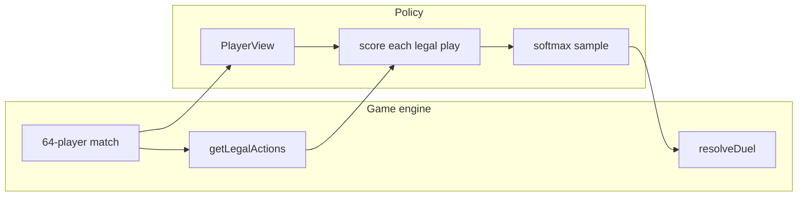
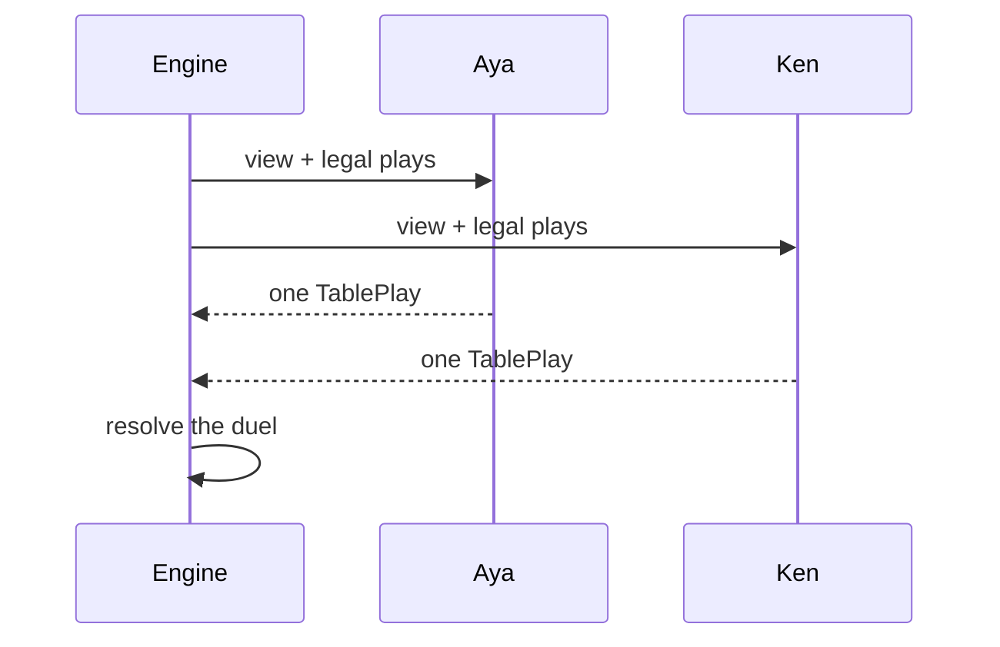
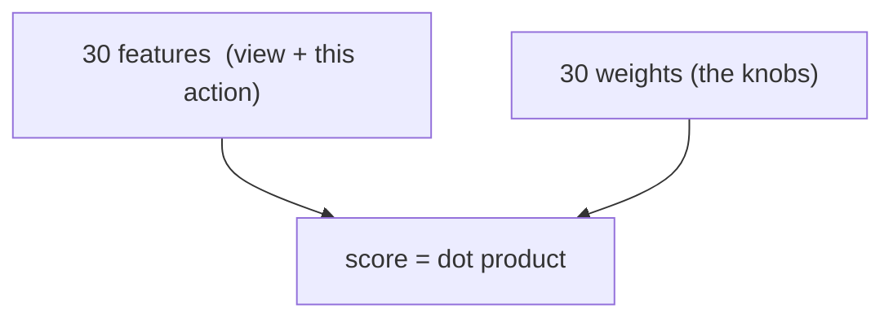
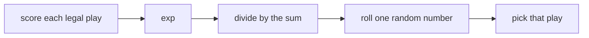
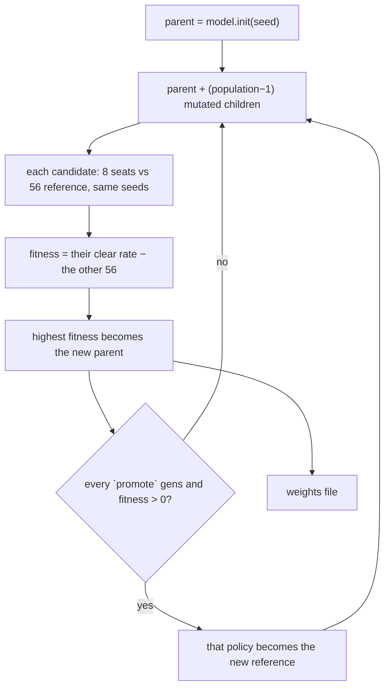
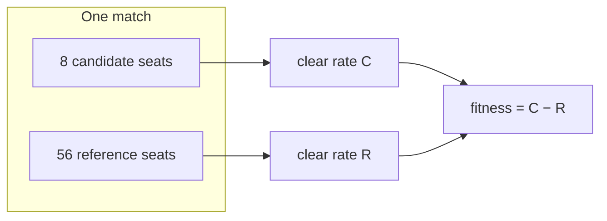
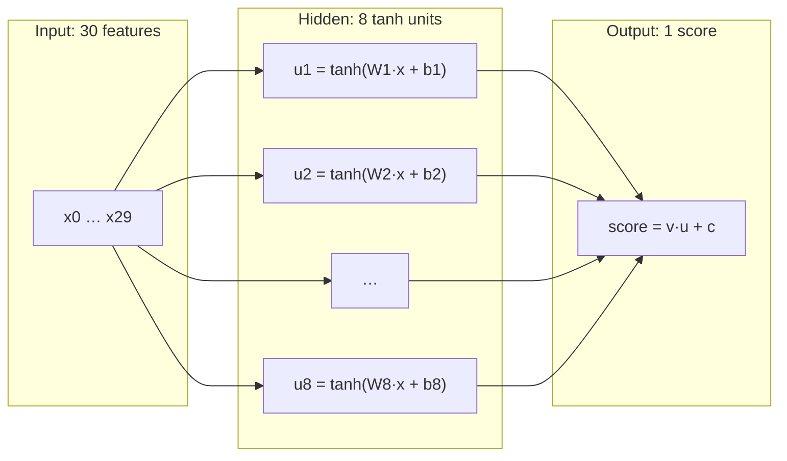

# How the trainer works (Zombie Hunt)

A walkthrough of the policy search on **this** project, not a general RL textbook.
The game is the 64-player, 20-round *Zombie Hunt* match. The code lives in `src/rl/`.
Saved weights: [`weights-latest.json`](./weights-latest.json). Run log: [`train-log.md`](./train-log.md).

Two models were trained: a **linear scorer** (30 numbers) and a **small network**
(257 numbers). Both are searched by the same optimiser, an evolution strategy. Both
end up at the same strength. This file explains all three pieces — the models, the
optimiser and the measurement — and ends with what the exercise established.

Every term that could be jargon is defined in the [glossary](#glossary) at the end,
including `sigma`, `generation`, `episode` and `probe`.

## The one sentence

A **policy** is a function: *given what I am allowed to know, pick one legal play*.
Training searches for a better function than “pick at random” by turning knobs — **30**
of them in the linear model, **257** in the network — and keeping the settings that win
more often.

It does **not** pick a winner among `randomLegal`, `aggressive`, and `conservative`.
Those three are handwritten yardsticks. The trainer writes a *fourth* function into
`docs/weights-latest.json`.

The sections below go in order: what the policy sees, the two models that turn that into
a choice, the optimiser that tunes them, how a policy is measured, and what came out.



## One decision at the table

Round 3. Aya sits against Ken. Pairing was random — she did not choose him.
She does **not** know if Ken is infected, and she does **not** know the living
zombie share. She knows her own cards, whether *she* is infected, how many cards
Ken is holding, the round number, and how many people are still alive.

The engine lists every legal play (every non-empty suit subset, with or without a
special). Vaccine is always on that list if she holds one; playing it against a
human is a miss and the card is gone. Shotgun is a guess.

Aya’s policy must pick **exactly one** row from that list. Ken’s policy picks at
the same time. Then the engine resolves shotgun / vaccine / zombie / sums / theft.



That happens at most once per living player per round, for 20 rounds, for 64 seats.
One match is 64 short stories that share one ending: the larger living faction
clears, the rest do not.

## Features: the situation as numbers

The policy does not read English. It reads two number lists glued together
(`concatFeatures` in `src/rl/features.ts`):

1. **View (20 numbers)** — who I am right now. Same for every legal play in this
   decision.
2. **Action (10 numbers)** — what this particular play would put on the table.

| Index | View feature | Meaning |
| --- | --- | --- |
| 0–2 | Spades count, sum, high rank | My spade pile |
| 3–5 | Hearts | |
| 6–8 | Diamonds | |
| 9–11 | Clubs | |
| 12 | Has shotgun | 1 or 0 |
| 13 | Has zombie card | 1 or 0 |
| 14 | Has vaccine | 1 or 0 |
| 15 | I am infected | 1 or 0 |
| 16 | My number-card count | Hit points / ammo |
| 17 | Opponent hand size | Cards Ken holds, not what they are |
| 18 | Round / 20 | How late we are |
| 19 | Living players | Headcount only |

Missing on purpose: Ken’s faction, Ken’s cards, living zombie share.

| Index | Action feature | Meaning |
| --- | --- | --- |
| 20 | Pile sum | Printed numbers on the cards I would play |
| 21 | Pile size | How many number cards I would expose |
| 22 | High rank in the pile | What I risk to theft if I lose |
| 23 | Share of that suit committed | 1 = I dump the whole suit |
| 24 | Share of my regulars committed | |
| 25 | Regulars left after this play | Cards I would still have |
| 26 | Special = none | 1 if this play has no special |
| 27 | Special = shotgun | |
| 28 | Special = zombie | |
| 29 | Special = vaccine | |

Exactly one of 26–29 is 1.

## Weights: 30 knobs

A weight is one number next to one feature. The whole policy is 30 weights
`w[0] … w[29]`. Start of training: all zeros. After training they are the array
in `docs/weights-latest.json`.

**Score of one legal play:**

```
score = w[0]*feature[0] + w[1]*feature[1] + … + w[29]*feature[29]
```

A **positive** weight means “this feature makes the play more attractive”.
A **negative** weight means the opposite. Magnitude is “how much”.



That is the whole “brain”. There is no hidden layer. If a useful rule needs an
*interaction* — “play Zombie only when I am already infected” — a linear scorer
cannot say it. It can only add `w[15]*infected` (same for every action) and
`w[28]*isZombiePlay` (same whether I am infected or not). That limit is why
later stages talk about an MLP.

### The linear gotcha

In one decision the 20 view numbers are identical for every legal play. Adding
`w_view · view` to every score does not change which play wins the softmax.
**Only the 10 action weights choose the card.** The view weights still sit in
the file (noise from evolution), but they do not steer Aya this generation.

That is why a linear search tends to rediscover a simple rule like “attach
Zombie to a pile”, which is close to the handwritten `aggressive` baseline.

## From scores to a play: softmax

Suppose Aya has three legal plays and the scorer returns:

| Play | Score |
| --- | --- |
| Small hearts, no special | −2.3 |
| Those hearts plus Zombie | +0.0 |
| Shotgun only | −1.5 |

The policy does **not** always take the maximum. Duels are simultaneous; a
predictable player is exploitable. It converts scores to probabilities with
`exp(score)` and **samples**:

```
P(play) = exp(score) / sum of exp(all scores)
```

Higher score → more often, not always. Zero weights → every `exp(0) = 1` →
uniform random, which is `randomLegal`.



## Interpreting the trained weights

Held-out file after 8 generations (seed 1). Action knobs only — these are the
ones that actually pick plays:

| Index | Feature | Weight | Reading |
| --- | --- | --- | --- |
| 20 | Pile sum | **+0.86** | Prefer a bigger number total |
| 21 | Pile size | +0.14 | Slight lean to more cards |
| 22 | High rank | +0.67 | Willing to flash a high card |
| 23 | Suit share | −0.77 | Avoid dumping a whole suit |
| 24 | Regular share | −0.51 | Avoid emptying the hand |
| 25 | Regulars left | −0.90 | Odd hitchhiker: more leftovers lower the score |
| 26 | No special | **−1.06** | Numbers-only is unattractive |
| 27 | Shotgun | −0.53 | Do not shotgun much (it is a guess) |
| 28 | Zombie | **+1.29** | Strongest knob: put Zombie down |
| 29 | Vaccine | **+1.24** | Also likes Vaccine — risky, because a miss is spent |

Worked toy: Aya has the 2 of hearts and a Zombie card.

- Hearts, no special: pile sum 2 plus “no special” (−1.06) → low score.
- Hearts **plus** Zombie: same pile sum **and** +1.29 → much more likely.

So the learned rule is not “Zombie alone”. It is closer to **`aggressive`**:
play Zombie when you hold it, and prefer a fat number pile.

That matches the measured result. On 200 held-out episodes the elite beats
`randomLegal` by **+0.265** (`aggressive` scores +0.251), and against an
`aggressive` table it lands on **+0.003**, with a confidence interval of
[−0.020, 0.026]. Linear search did not just find the same neighbourhood — it
converged to a **tie** with the handwritten heuristic, and 60 generations could
not push it past.

## How training works

### No gradients

Neural networks are usually trained by backpropagation: compute how the loss would
change if each weight changed slightly, then step every weight against that gradient.
That is impossible to do directly here. The thing we care about — “did this player end
up on the larger faction after 20 rounds” — is a 0 or a 1 that emerges from a discrete
simulation with random pairing, random theft and 63 other players. There is no
derivative of that outcome with respect to `w[28]`.

So the optimiser is an **evolution strategy**: change the numbers at random, play the
games, keep what scored better. It only ever needs to *evaluate* the policy, never to
differentiate it. The cost is sample efficiency — it learns from outcomes, not from
gradients — which is affordable because a full 64-player match takes about 10
milliseconds.

The variant used is a **(1+λ) hill climber**: one parent, λ mutated children, best one
survives. Code: `trainEs` in `src/rl/train.ts`.

### Sigma: the size of the random nudge

**Sigma is one number: how far each weight is allowed to jump when making a mutated
copy.** Formally it is the standard deviation of the Gaussian noise added to every
parameter. It is the single most important knob in the whole trainer, so here it is in
full.

To create a child from a parent, walk through the parameters one at a time. For each
one, draw a random number from a bell curve centred on zero whose width is sigma, and
add it. That is the entire mutation — one line in `src/rl/train.ts`:

```ts
return weights.map((value, index) => value + sigma * (scale?.[index] ?? 1) * gaussian(random));
```

Concretely, with `sigma = 0.2` and a parent whose zombie weight is `w[28] = 1.29`, four
children might carry `1.41`, `1.02`, `1.35` and `1.19`. Every one of the other 29
weights is nudged independently in the same way, so a child differs from its parent in
all coordinates at once.

Because the noise is Gaussian, sigma tells you the typical size of the nudge rather
than a hard limit:

| Draw lands within | Share of the time |
| --- | --- |
| ±1 sigma | about 68% |
| ±2 sigma | about 95% |
| ±3 sigma | about 99.7% |

Choosing it is a real trade-off, and it is why the logs mention sweeping it:

- **Too small** and the search crawls. Every child is nearly identical to its parent,
  so the fitness differences between them are smaller than the measurement noise and
  selection picks essentially at random.
- **Too large** and the search cannot hold on to anything. Every child is a wild
  rewrite of a working policy, so good solutions get destroyed rather than refined.

Three things sigma is **not**. It is not a learning rate: nothing here follows a
gradient, and sigma sets the width of a random probe rather than the length of a step
along a known direction. It is not a probability. And it is not annealed — it stays
fixed for the whole run in this implementation.

One shared sigma assumes every parameter lives on a similar scale. That holds for the
linear model, whose 30 weights all end up between roughly −1.3 and +1.3. It fails
badly for the network, which is covered under
[the warm start](#why-sigma-had-to-become-per-parameter) once its layers have been
introduced.

### The loop

Start from `model.init(seed)`: 30 zeros for the linear model, a small random draw or
the warm start for the network. Then each **generation**:

1. Keep the parent unchanged as candidate 0, so a generation can never go backwards on
   its own measurement.
2. Make `population − 1` mutated children, each parameter nudged as described above.
3. Play `episodes` matches per candidate and score each one with the differential
   fitness below. Every candidate in the generation gets the **same match seeds**, so
   they face identical deals and identical pairings — a paired comparison, which
   removes most of the luck from the ranking.
4. The highest-scoring candidate becomes the parent of the next generation. It is
   called the **elite**.
5. Every `promote` generations, if the elite is still beating the current reference,
   freeze it as the new reference. The opposition therefore improves as the policy
   does, instead of remaining 56 random bots forever.



Steps 3 and 5 are where the wall-clock goes, and step 5 is why generations get slower
as a run proceeds: once the reference is a trained policy, all 64 seats are running a
scorer instead of 56 cheap random bots.

### The command and its knobs

```bash
npm run train -- --model mlp --hidden 8 --warm docs/weights-latest.json \
  --seed 1 --generations 40 --population 24 --episodes 100 --probe 150 --sigma 0.1 --promote 4
```

| Flag | Meaning | Effect if raised |
| --- | --- | --- |
| `--model` | `linear` or `mlp` | — |
| `--hidden` | hidden units in the network | More capacity, more parameters to search |
| `--warm` | linear weights file to imitate at start | Search begins at the linear plateau |
| `--warm-preact` | pre-activation budget for the warm start | Lower is a more faithful copy |
| `--seed` | fixes every random draw | Reproducibility, nothing else |
| `--generations` | how many mutate-and-select rounds | Longer search, linearly more time |
| `--population` | candidates per generation | Wider search per step |
| `--episodes` | matches per candidate | Less selection noise, linearly more time |
| `--probe` | matches for the log columns only | Readable trend lines, no effect on search |
| `--sigma` | size of the random nudge | Bolder jumps; see the trade-off above |
| `--promote` | generations between reference promotions | Slower-moving opposition |
| `--dry-run` | write the starting weights and exit | Lets a warm start be measured before training |

The trade-off worth internalising: `--generations` buys more steps, `--episodes` buys
more certainty about which step to take. The first real run mistook the second for a
luxury, spent 5 episodes per candidate, and selected mostly noise.

## Fitness: why 8 seats vs 56

Reward for one player is **1** if they are alive on the larger faction after
round 20, else **0**. Tie of factions → 0 for everyone.

If all 64 seats run the same policy, they mostly share one fate: zombies win
together or humans win together. Absolute clear rate then measures the
faction split, not skill.

So a **candidate** sits in **8** seats. The other **56** run the reference
(`randomLegal` at first, later a frozen elite). Same deal, same seed.

```
fitness = clear rate of the 8 − clear rate of the 56
```

If the 8 land on the winning side more often than the 56, fitness is positive.
`aggressive` vs `randomLegal` was +0.257. That is the bar.



The log also prints numbers we **do not** maximize: zombie share when all 64
seats run the elite, and elite vs `aggressive`. Those are a dashboard. Mass
infection is a story hypothesis, not the training objective. Pairing is still
random and infection is still private — and the search found it anyway: with
every seat on the elite, 70–99% of the living end up infected. The canon
solution came out of the search, not out of the reward.

Keep the probe episode count high (`--probe`). These columns are a trend, not a
fitness, and on four matches a zombie share can only read 0.00, 0.25, 0.50,
0.75 or 1.00 — which is exactly how the first run produced a table of round
numbers that looked like a signal.

## What the log columns mean

From [`train-log.md`](./train-log.md):

| Column | Meaning |
| --- | --- |
| vs reference | Fitness used to pick the elite this generation |
| vs randomLegal | Same elite, always against the original random table |
| vs aggressive | Same elite against the handwritten “play Zombie” table |
| zombie share | Fraction infected at the end when all 64 use the elite |
| reference | Who the 56 seats were this generation |

`vs randomLegal` going up means “better than chance on a random table”.
`vs aggressive` reaching zero and staying there means “as good as the obvious
heuristic, and no better”. That is where the linear model stops.

## How this differs from “try three strategies”

| Handwritten baseline | Linear ES |
| --- | --- |
| A named `if` | 30 numbers |
| You already know the rule | Search writes the rule |
| Used as a measuring stick | Used as the thing being trained |

`npm run simulate -- --weights docs/weights-latest.json --reference randomLegal`
drops the learned function into the **same** 8-vs-56 harness as `aggressive`.
That is the only fair comparison.

## The network

A dot product cannot let one feature change the meaning of another, so the next model
was a neural network. Code: `src/rl/mlp.ts`.

### Topology

Three layers, written `30 → 8 → 1`:

| Layer | Size | What it is |
| --- | --- | --- |
| Input | 30 values | The same features as the linear scorer, rescaled |
| Hidden | 8 units | Each unit reads all 30 inputs, applies `tanh` |
| Output | 1 value | The score of **one** legal play |



It is **fully connected** (every input reaches every hidden unit) and **feed-forward**
(no loops, no memory of earlier rounds). One hidden layer, not two.

### The output is one score, not a choice

This is the part that usually surprises people. The network does **not** have one
output per possible play. It has a single output, and it is run **once per legal
play**.

If Aya has 11 legal plays this turn, the network runs 11 times — same 20 view numbers,
different 10 action numbers each time — producing 11 scores. Those 11 scores then go
through one softmax, and one play is sampled.

The reason is that the number of legal plays changes constantly. It depends on how many
suits she holds, how many cards are in each, and which specials are in hand. A fixed
output layer of size *N* cannot represent a choice set whose size moves between 1 and a
few hundred. Scoring each candidate play separately sidesteps the problem entirely, and
illegal plays are never scored at all rather than being masked out afterwards.

### Parameters

| Block | Count | Arithmetic |
| --- | --- | --- |
| Input → hidden weights | 240 | 30 inputs × 8 units |
| Hidden biases | 8 | one per unit |
| Hidden → output weights | 8 | one per unit |
| Output bias | 1 | |
| **Total** | **257** | |

Those 257 numbers are the entire model, stored as a flat array in the weights file
under `kind: "mlp-v1"`. `mlpDim(hidden)` computes the count; the layout is
input block, then hidden biases, then output weights, then the output bias.

### The activation function: tanh

Each hidden unit computes a weighted sum and then squashes it through the hyperbolic
tangent:

```
u = tanh(W·x + b)
```

`tanh` maps any real number into (−1, 1), is zero at zero, and is S-shaped:

| Input `z` | `tanh(z)` | Region |
| --- | --- | --- |
| 0.0 | 0.000 | flat, behaves like `z` |
| 0.5 | 0.462 | nearly linear |
| 1.0 | 0.762 | bending |
| 2.0 | 0.964 | nearly flat |
| 3.0 | 0.995 | saturated |

Two consequences run through everything below.

**Without it the network would be pointless.** Stack two linear layers and the result
is still linear: `v·(W·x) = (v·W)·x`, which is just another dot product. `tanh` is the
non-linearity that lets the 8 units carve the input space into regions, so the model
can express “a big pile is good, *unless* my hand is nearly empty”. That conditionality
is the only reason to prefer a network here.

**Saturation is the failure mode.** Past about `|z| = 3` the output barely changes, so
the unit stops responding to its inputs. The raw features include a `livingCount` of up
to 64 and pile sums above 40, which would push every unit straight into saturation. So
the MLP path divides each feature by a fixed constant first (`FEATURE_SCALE` in
`src/rl/features.ts`), landing every input in roughly [−1, 1]. The linear scorer needs
none of this, because it can simply carry a small weight instead — which is why the
scaling is applied only on the network path, leaving the committed linear weights
reproducible.

### Forward pass, worked through

Full-size numbers are unreadable, so here is the identical computation with 3 inputs
and 2 hidden units.

Input: `x = [1.0, 0.5, 0.0]`

Hidden unit 1, weights `[0.5, −0.2, 0.1]`, bias `0.0`:

```
z1 = 0.5·1.0 + (−0.2)·0.5 + 0.1·0.0 + 0.0 = 0.4
u1 = tanh(0.4) = 0.380
```

Hidden unit 2, weights `[−0.3, 0.8, 0.2]`, bias `0.1`:

```
z2 = (−0.3)·1.0 + 0.8·0.5 + 0.2·0.0 + 0.1 = 0.2
u2 = tanh(0.2) = 0.197
```

Output, weights `[1.5, −0.5]`, bias `0.2`:

```
score = 1.5·0.380 + (−0.5)·0.197 + 0.2 = 0.671
```

That single number is the score for one legal play. Repeat for the other legal plays,
softmax, sample. The real model does the same thing with 30 inputs and 8 units.

### Initialisation

The linear scorer starts at **all zeros**, which is exactly the uniform random policy:
every score is 0, so the softmax is flat.

Zeros do not work for the network. Every hidden activation would be `tanh(0) = 0`, so
the output weights would multiply zero and changing them would do nothing; only a
simultaneous, lucky change in *both* layers could produce any signal. So the network
starts from a small seeded random draw, spread `1/sqrt(30)`, in `initMlp`.

## What happened when the network was trained

Twice, with opposite starting points.

**Cold start — never learned.** Twenty generations left it at +0.009 against
`randomLegal`, which is random play. This says nothing about capacity. The linear
scorer steers the softmax by driving one weight to about 8, while the freshly
initialised network produces a sum of eight bounded units times output weights near
0.18 — a total score range of roughly ±1.4, so the softmax starts almost flat and
every play is near-equally likely. On top of that, picking the best of 16 random
directions is a weak search in 257 dimensions.

**Warm start — began at the plateau, stayed there.** Since `tanh(z) ≈ z` near zero, a
network *can* imitate a linear scorer. Give every hidden row `eps` times the linear
weights and every output weight `1/(8·eps)`; the network then computes
`tanh(eps·w·x)/eps`, which is the linear score whenever the pre-activation stays small.
Measured before any training, that network scored +0.267 against `randomLegal` — the
linear policy's +0.265. Training started exactly on the plateau.

### Why sigma had to become per-parameter

The warm start is also what forced the step size to change shape.

Imitating a linear scorer requires *small* input weights, so the pre-activations stay
in the near-linear part of `tanh`, together with a *large* output weight to undo that
shrinking. Measured on the real warm start: input weights average `0.03`, output
weights are `44.5` — three orders of magnitude apart, in the same parameter vector.

A shared `sigma = 0.05` applied across it would change the input weights by about 150%,
obliterating them, while moving the output weights by 0.1%, which is nothing. The first
layer gets destroyed and the second is effectively frozen.

The fix is `mlpSigmaScale`: each parameter's nudge is multiplied by the average
magnitude of its own layer. Sigma then means “this fraction of the layer's typical
size”, so `sigma = 0.1` is a 10% adjustment everywhere and the one number is meaningful
in both layers. Models that supply no `sigmaScale` — the linear one — keep a single
shared sigma, which is why the earlier linear run still reproduces generation for
generation.

### The result

Forty generations of 24 candidates at 100 episodes, from the warm start, with per-layer
steps and after a sigma sweep at 0.05 / 0.1 / 0.2: **+0.001** against `aggressive`,
CI [−0.019, 0.021]. The linear policy sits at +0.004. Nothing moved.

### “It does not converge” — it converged; that is the problem

Worth separating two different outcomes, because they look alike in a log and mean
opposite things.

The **cold-start network genuinely failed to learn**: it sat at random-play strength,
so the search never got going.

The **linear model and the warm-started network both converged**, and converged fast.
A self-play system that has settled shows exactly the signature in the log: `vs
reference` hovering around zero, because the elite is being measured against a copy of
itself, while `vs randomLegal` holds a steady positive value. The linear run reached
that state by generation 20 and held it for the next forty.

So the search did its job. The disappointment is *where* it settled: on the same
strategy as a three-line heuristic. That is a fact about this game under these rules,
not a training failure — which is what the elimination table below is for.

## What the whole exercise established

Four explanations were eliminated in order, each by an experiment rather than an
argument:

| Suspect | Ruled out by |
| --- | --- |
| Too few samples | 108k episodes on the linear model; the curve is flat for 40 generations |
| Bad starting point | Warm start begins at the plateau and stays there |
| Wrong step size | Per-layer scaling, plus sweeps at sigma 0.05 / 0.1 / 0.2 |
| Too little capacity | 257 parameters handed the linear solution gain nothing |

What survives is the **observation**. The policy knows its own hand and faction, the
opponent's hand size, the round and the living count. It does not know whether the
opponent is infected, because that rule was locked private on 2026-09-16. Without that
bit, a shotgun and a vaccine are lotteries, not decisions — and no amount of capacity
converts a lottery into a decision.

So the honest summary is that under private infection this game has a simple optimum,
and the search found it: play Zombie when you hold it. The learned policy and the
three-line heuristic are the same strategy, reached from opposite directions.

One result came for free and is worth keeping. Mass infection was never rewarded — the
reward only says “stand on the larger side” — yet when all 64 seats run the trained
policy, 70–99% of survivors end up infected. The canon solution from the show emerged
from the search rather than from the objective.

## What we did not train

- Who to sit against (pairing is still the environment).
- A model of “Ken is probably a zombie”.
- PPO / backpropagation. It would swap the optimiser, and the optimiser is not the
  constraint.
- `/watch` does not train. It is the dealer camera. Training is the CLI.

## If this is ever picked up again

The one experiment that would still say something: add the opponent's faction and the
zombie share to the view and retrain the **linear** model. If that beats `aggressive`,
the private-infection rule is what caps the policy. If it does not, the game really is
“play Zombie” and there is nothing left to find.

## Glossary

| Term | In this project |
| --- | --- |
| **Policy** | A function from “what I may know” to one legal play. The thing being trained. |
| **Feature** | One number describing the situation or a candidate play. 30 of them. |
| **Weight / parameter** | One tunable number inside the model. 30 for linear, 257 for the network. |
| **Score** | The model's output for **one** legal play. Not a probability. |
| **Softmax** | Turns a list of scores into probabilities via `exp(score) / Σ exp(scores)`, then one is sampled. |
| **Episode** | One complete 64-player, 20-round match. About 10 ms. |
| **Reward** | 1 if a player is alive on the larger faction at the end, else 0. Nothing in between, nothing earlier. |
| **Generation** | One round of “mutate the parent, play the games, keep the best”. |
| **Population** | How many candidates exist in a generation, parent included. |
| **Sigma** | Standard deviation of the Gaussian noise added to each parameter when making a child — the size of the random nudge. |
| **Sigma scale** | Per-parameter multiplier on sigma, so each layer is nudged relative to its own magnitude. |
| **Mutation** | Adding that noise to every parameter of a copy. |
| **Elite** | The highest-fitness candidate of a generation; becomes the next parent. |
| **(1+λ)** | One parent, λ children, best survives. The optimiser's shape. |
| **Evolution strategy** | Optimising by random perturbation and selection rather than by gradients. |
| **Fitness** | Candidate clear rate minus reference clear rate in the same matches. |
| **Differential** | That subtraction. Necessary because absolute clear rate mostly measures the faction split. |
| **Reference / league** | The policy in the other 56 seats. Starts as `randomLegal`, later a frozen elite. |
| **Promotion** | Freezing the current elite as the new reference. |
| **Probe** | Extra matches played only to fill the log columns. Never affects selection. |
| **Seed** | Integer fixing every random draw, so a run replays exactly. |
| **Common random numbers** | Giving every candidate in a generation the same seeds, so the ranking is a paired comparison. |
| **Held-out** | Evaluation on seeds the search never saw. |
| **Baseline** | A handwritten policy used as a yardstick: `randomLegal`, `aggressive`, `conservative`. |
| **Plateau** | Fitness stops improving while the search keeps running. |
| **Saturation** | A `tanh` unit pushed far enough from zero that its output stops responding. |
| **Warm start** | Initialising the network so it reproduces the trained linear policy. |
| **Backpropagation** | The gradient method **not** used here; there is no derivative of a match outcome. |

## Files

| File | Role |
| --- | --- |
| `src/rl/features.ts` | View and action numbers, plus the scales the MLP needs |
| `src/rl/scorer.ts` | Dot product + softmax policy |
| `src/rl/mlp.ts` | Network scorer, warm start, per-layer step scaling |
| `src/rl/model.ts` | What the trainer needs to know about a parameter vector |
| `src/rl/train.ts` | Nudge (sigma), evaluate, keep the elite |
| `src/rl/trainCli.ts` | Flags, progress lines, weight file, log file |
| `src/rl/evaluate.ts` | 8 vs 56 fitness |
| `docs/weights-latest.json` | The 30 knobs after the last train |
| `docs/train-log.md` | Generation table + held-out scores |
| `docs/baselines-2026-09-16.md` | Yardsticks before any learning |
